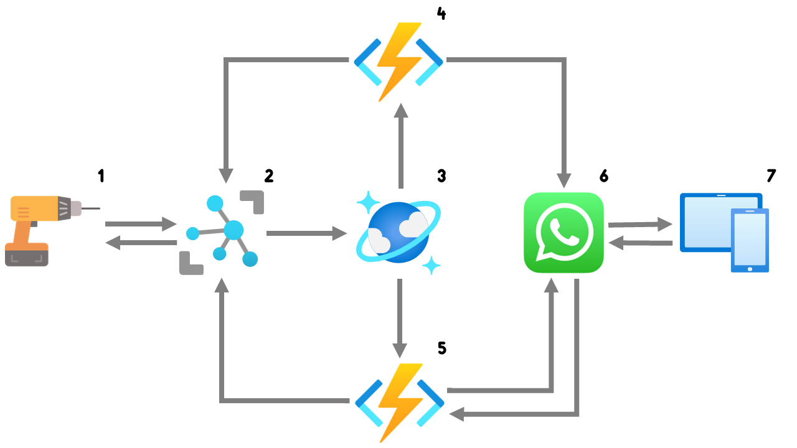
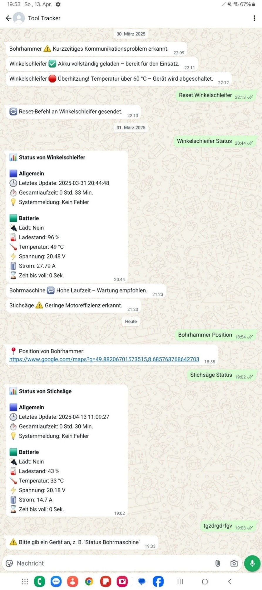

# IoT Tool Tracking and Monitoring using Microsoft Azure

A cloud-based IoT solution for monitoring battery-powered tools using Microsoft Azure.

The project simulates multiple IoT devices that periodically send telemetry data to Azure IoT Hub. Incoming telemetry is processed automatically using Azure Functions, stored in Azure Cosmos DB, and evaluated for predefined warning and error conditions.

Depending on the received telemetry, the system can:

- Send WhatsApp notifications
- Retrieve the current device status
- Provide the latest device location
- Recommend maintenance
- Remotely shut down simulated devices

This project was developed as part of my Bachelor's thesis in Business Information Systems.

---

# Architecture

The following diagram illustrates the overall system architecture.



## Workflow

1. Simulated IoT devices generate telemetry data.
2. Telemetry is sent securely to Azure IoT Hub.
3. Azure IoT Hub routes incoming telemetry to Azure Cosmos DB.
4. A Cosmos DB Trigger Azure Function processes and evaluates the telemetry.
5. Critical events trigger Cloud-to-Device commands via Azure IoT Hub.
6. Notifications are sent through the WhatsApp Cloud API.
7. Users can interact with the system through WhatsApp to retrieve device information.

---

# Example User Interaction

The solution provides a WhatsApp interface that allows users to interact with the simulated IoT devices.

Supported interactions include:

- Automatic warning and error notifications
- Current device status
- Current battery status
- Device location
- Maintenance recommendations
- Remote device shutdown
- Device reset



---

# Features

- Simulation of multiple IoT devices
- Realistic telemetry generation
- Azure IoT Hub integration
- Azure Cosmos DB storage
- Event-driven Azure Functions
- Automatic anomaly detection
- Cloud-to-Device communication
- WhatsApp integration
- Remote device control
- Device status queries
- Device location queries
- Automatic maintenance recommendations

---

# Azure Services

The following Microsoft Azure services are used within this project:

| Service | Purpose |
|----------|---------|
| Azure IoT Hub | Secure communication with simulated IoT devices |
| Azure Cosmos DB | Storage of telemetry data |
| Azure Functions | Serverless processing of telemetry and business logic |

---

# Example Telemetry

A sample telemetry message generated by the simulated IoT devices is available in:

```text
examples/telemetry-message.json
```

The example demonstrates the structure of the telemetry data transmitted to Azure IoT Hub, including:

- Device information
- Battery measurements
- Runtime information
- Tool events
- Location data
- Timestamps

---

# Repository Structure

```text
.
├── README.md
├── src
│   ├── device-simulator
│   │   └── iot-device-simulator.py
│   ├── get-device-status
│   │   ├── __init__.py
│   │   └── function.json
│   └── process-device-telemetry
│       ├── __init__.py
│       └── function.json
├── examples
│   └── telemetry-message.json
└── images
    ├── architecture-diagram.png
    └── whatsapp-interface.jpg
```

---

# Technologies

- Python
- Microsoft Azure
- Azure IoT Hub
- Azure Functions
- Azure Cosmos DB
- WhatsApp Cloud API
- JSON

---

# Lessons Learned

During the implementation of this project, the following concepts and technologies were explored:

- Designing event-driven cloud architectures
- Processing IoT telemetry using Azure Functions
- Integrating Azure IoT Hub with Azure Cosmos DB
- Implementing Cloud-to-Device communication
- Developing serverless applications on Microsoft Azure
- Integrating external REST APIs
- Working with asynchronous event processing
- Designing scalable IoT solutions

---

# Disclaimer

This repository contains a simplified version of the solution developed as part of my Bachelor's thesis.

Sensitive information such as connection strings, API keys, resource identifiers, and secrets have been removed or anonymized.

Telemetry data, device identifiers, and sample messages are provided for demonstration purposes only.
